# College Management System (CMS)

## Overview
The College Management System (CMS) is a web-based application designed to streamline academic data management. It provides dedicated dashboards for students, lecturers, and administrators to manage attendance, marks, and other academic records efficiently.

---

## Features

### Student Dashboard
- View personal details.
- Check daily attendance records and overall attendance percentage.
- View subject-wise attendance breakdown.
- View marks for each subject in real-time.

### Lecturer Dashboard
- View teaching timetable.
- Take attendance for classes on specific dates.
- Upload and update student marks.
- Access analytics for attendance and marks of classes taught.

### Admin Dashboard
- Manage student, lecturer, and class records.
- Assign lecturers to subjects and classes.
- Monitor overall academic data.

---

## Setup

1. Clone the repository:
   ```sh
   git clone <REPO_URL>
   cd academic-management-portal
   ```

2. Install dependencies:
   ```sh
   npm install
   ```

3. Configure MongoDB connection in `.env` file:
   ```sh
   MONGODB_URI=<your-mongodb-uri>
   ```

4. Start the server:
   ```sh
   nodemon src/index.js
   ```

## Usage

### Student Dashboard
- Login as a student to view attendance, marks, and personal details.
<p align="center">
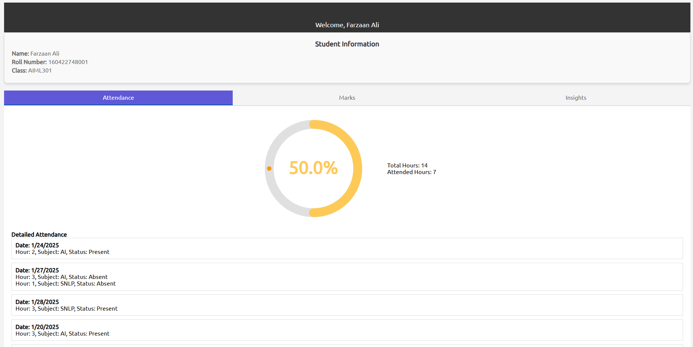
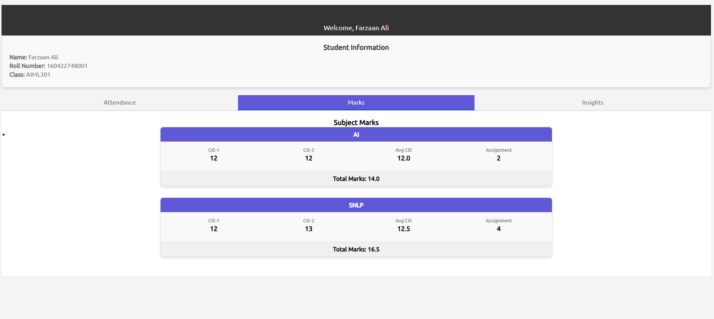
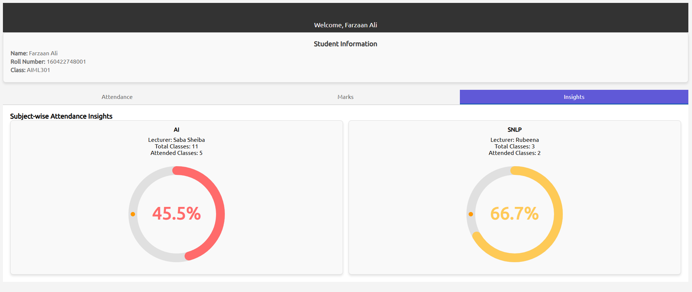
</p>


### Lecturer Dashboard
- Login as a lecturer to take attendance, upload marks, and view analytics.
<p align="center">
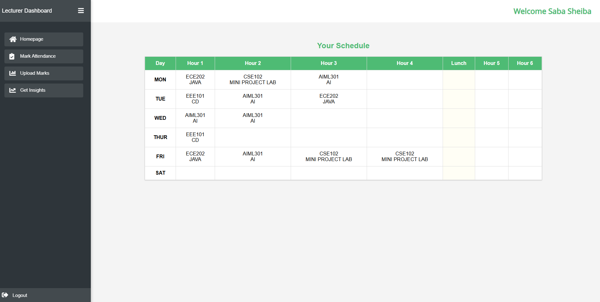
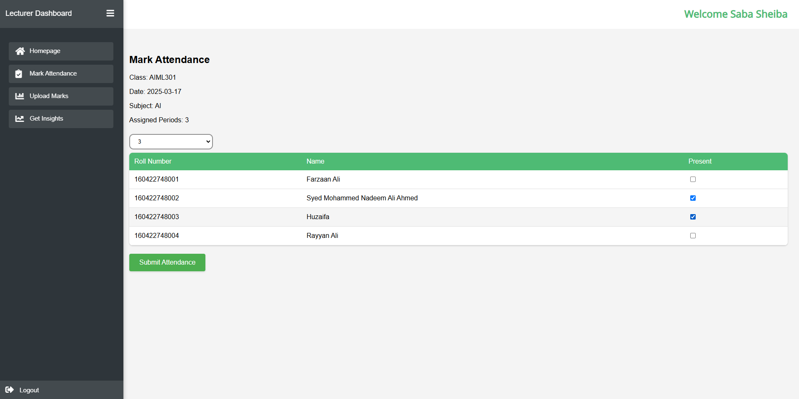
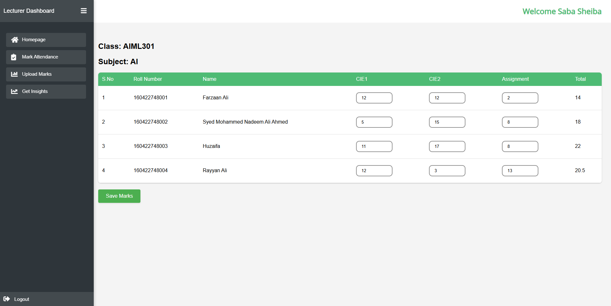
</p>
<p align="center">
  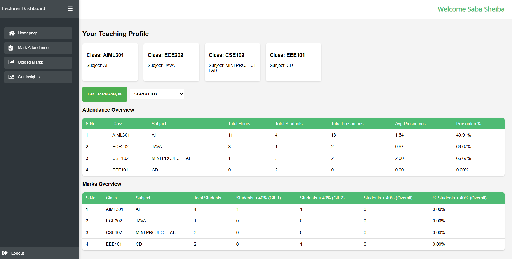
  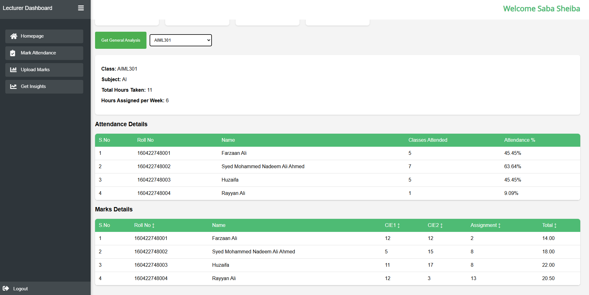
</p>

### Admin Dashboard
- Login as an admin to manage users, subjects, and classes.
<p align="center">
  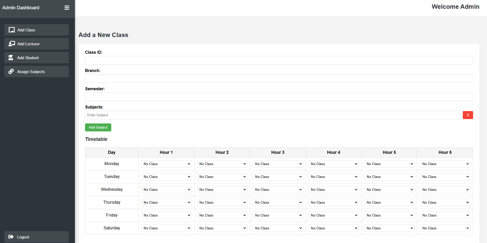
  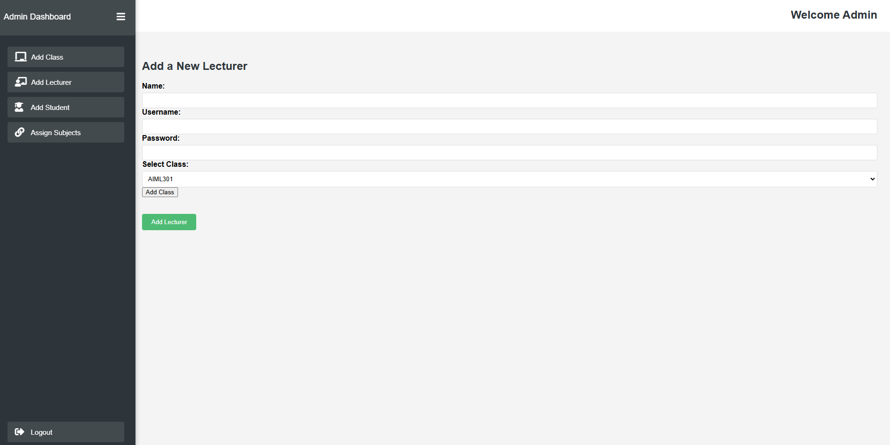
</p>
<p align="center">
  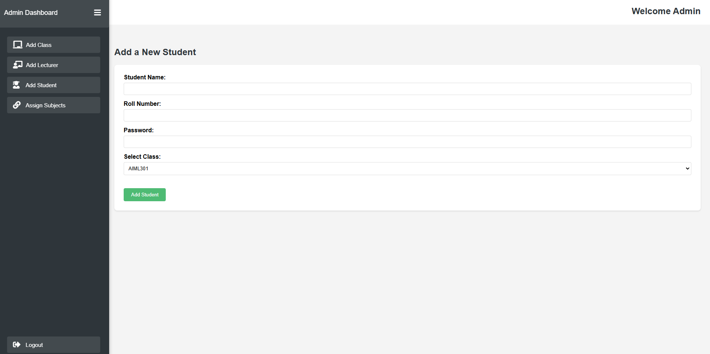
  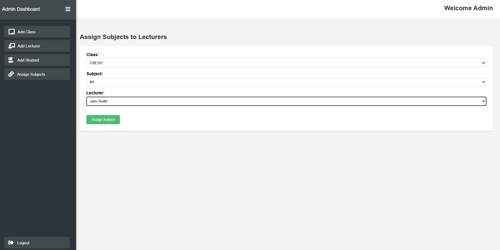
</p>
